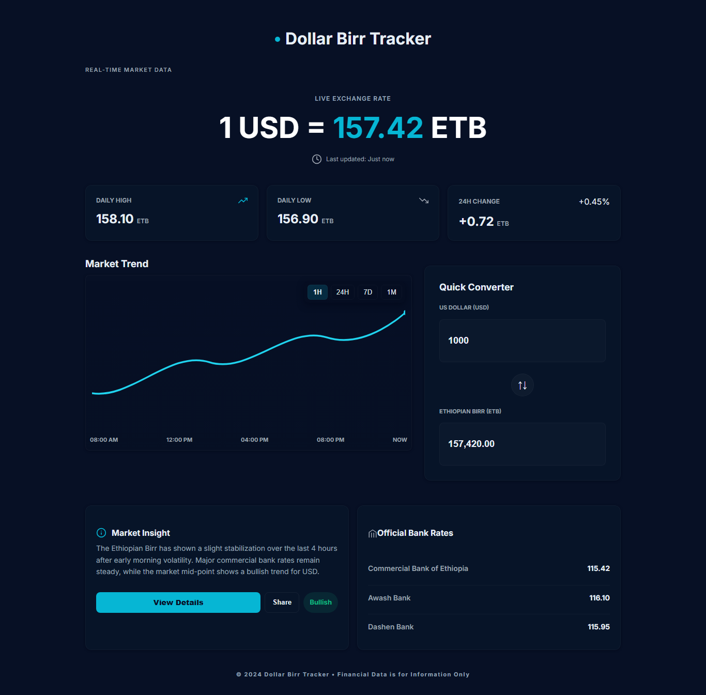

# Dollar Birr Tracker

**Dollar Birr Tracker** is a dedicated real-time dashboard designed to bridge the information gap in the currency market. It allows users to monitor the fluctuating exchange rate between the **United States Dollar (USD)** and the **Ethiopian Birr (ETB)** instantly.

https://besuhosiso.github.io/dollar-birr-tracker/

This project was built to provide clarity by comparing live market trends against official banking rates in a single, modern interface.

## 📱 Project Preview

## 🔥 Key Features

Here is what the tracker provides:

*   **Real-Time Exchange Rate:** Displays the current live market rate (e.g., 1 USD = 157.42 ETB) with instant updates.
*   **Market Trends:** An interactive graph visualizing how the currency has performed over the last hour, 24 hours, week, or month.
*   **Parallel vs. Official Rates:** A crucial comparison section that shows the difference between the trading market rate and official banks like **Commercial Bank of Ethiopia**, **Awash Bank**, and **Dashen Bank**.
*   **Quick Converter:** A built-in calculator that lets users input USD amounts to see exactly how much ETB they would receive, complete with estimated transfer times.
*   **Daily Stats:** Tracks the daily high, daily low, and percentage change to help users spot the best time to exchange.
*   **Market Insights:** Provides brief textual analysis on market volatility and stabilization trends.

## 💡 Why This Matters

The exchange rate between the Dollar and the Birr can be volatile and varies significantly depending on where you look. This dashboard aggregates that data into one clean, "Dark Mode" aesthetic, making financial data easy to read and understand at a glance.

---

## 📬 Contact Me

If you have questions about the project, suggestions for new features, or just want to say hi, feel free to reach out:

*   **Email:** [besuyeboss@gmail.com]
*   **Instagram:** [https://www.instagram.com/besuhosiso5/]
*   **LinkedIn:** [https://www.linkedin.com/in/besufikad-hosiso-23a2313aa/]

*Disclaimer: All financial data displayed in this project is for informational purposes only.*
