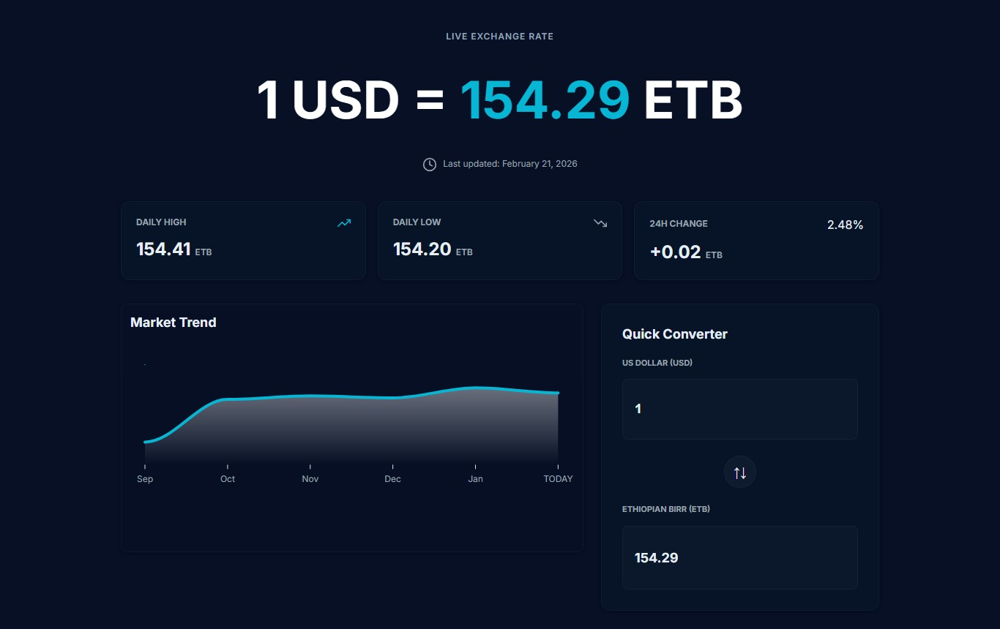

# Dollar Birr Tracker

[Live Demo](https://besuhosiso.github.io/dollar-birr-tracker/)

Dollar Birr Tracker is a dedicated real-time dashboard designed to bridge the information gap in the currency market. It allows users to monitor the fluctuating exchange rate between the United States Dollar (USD) and the Ethiopian Birr (ETB) instantly using real-time APIs. This project provides clarity by comparing live market trends with official banking rates within a modern, responsive interface.

## 📱 Project Preview

## 🔥 Key Features

- **Real-Time Exchange Rate:** Instantly displays the current live market rate (e.g., 1 USD = 157.42 ETB) with frequent, automatic updates via real-time APIs.
- **Market Trends:** Interactive graph visualizes how the exchange rate changed over the last hour, 24 hours, week, or month.
- **Parallel vs. Official Rates:** Compares the trading market rate with official rates from major Ethiopian banks (e.g., Commercial Bank of Ethiopia, Awash Bank, Dashen Bank).
- **Quick Converter:** Lets users input USD amounts to see exactly how much ETB they would receive, along with estimated transfer times.
- **Daily Stats:** Tracks the daily high, daily low, and percentage change—helping users spot the best time to exchange.
- **Market Insights:** Provides textual summaries to help users understand current market volatility and stabilization trends.
- **Modern UI:** Clean "Dark Mode" design for readability and aesthetics.

## 💡 Why This Matters

The volatile exchange rate between Dollar and Birr can differ greatly depending on the market or bank. Dollar Birr Tracker aggregates this information into a single, accessible dashboard, empowering individuals and businesses to make informed decisions quickly.

## 🚀 Technologies Used

- JavaScript (API integrations, dashboard logic)
- HTML, CSS (UI design & responsive layout)
- Real-time currency APIs

## 📬 Contact Me

For questions, feature suggestions, or feedback, feel free to reach out:

- Email: besuyeboss@gmail.com
- Instagram: [besuhosiso5](https://www.instagram.com/besuhosiso5/)
- LinkedIn: [Besufikad Hosiso](https://www.linkedin.com/in/besufikad-hosiso-23a2313aa/)

*Disclaimer: All financial data displayed is for informational purposes only.*

---

You can use this for your project section or update your repository README as needed! If you want further customization, just let me know.
